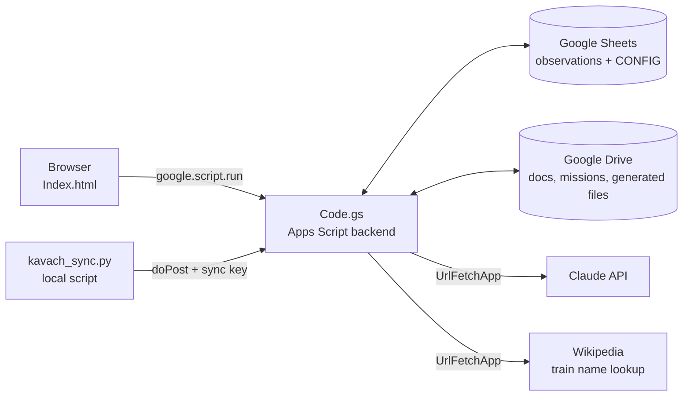

<div align="center">

# 🚆 BRC KAVACH Dashboard

**Failure monitoring, verification and reporting portal for KAVACH (TCAS) on Vadodara (BRC) Division, Western Railway**


-lightgrey)

</div>

---

## ✨ What it is

A single-page web app served by **Google Apps Script**, with **Google Sheets as the database** and **Google Drive as file storage**. Railway staff and OEM engineers (Medha, HBL) log KAVACH failures observed on trains, a railway officer verifies them, and the system tracks each case through rectification, then produces monthly reports, analytics and AI-drafted memos.

| | |
|---|---|
| **Sections covered** | BRC–GDA, VS–URN, BJW–ADI (configurable in Admin Panel) |
| **OEMs supported** | Medha, HBL (each restricted to its own sections) |
| **Code size** | `Code.gs` ≈ 7,250 lines · `Index.html` ≈ 17,700 lines |
| **Dependencies** | None to install. Uses CDN libraries in the browser only |

## 🧩 Features

The UI is a tabbed dashboard (dark/light theme). Tabs, grouped by purpose:

### Capture and workflow
| Tab | Purpose |
|---|---|
| **Log Observation** | Multi-step form: train, loco, section, gear at fault, reason, station, description. Supports several failures per journey and NIL entries. Train and loco details auto-fill from cached lookups |
| **Pending Verification** | Railway staff verify or reject observations using a personal PIN |
| **R&D Queue / Loco Log Queue** | Cases routed for R&D analysis or loco log download, then closed with a remark |
| **Rectification** | Track and resolve fixes for verified failures |
| **⚡ Quick Reg** | Fast pre-registration of an event, with a pending-count badge |
| **🛡️ ICMS** | ICMS case list, fed by the sync script or a manual CSV upload |
| **Labels / MEMO & OPR** | Tag observations (ICMS / Non-ICMS / custom), track memo and OPR status |

### Analytics and reports
| Tab | Purpose |
|---|---|
| **Monthly Report** | Weekly and monthly breakdowns with drill-down rows |
| **OEM Analytics** | Per-OEM and per-loco failure analytics over a date range |
| **🧭 Deep Analytics** | Filter, group and compare across any field |
| **🔎 Fault Codes** | Searchable fault-code library (hex/dec), bulk import |
| **📶 RSSI Heatmap** | RSSI heatmap analyzer, loadable from an observation SR |
| **🧾 LM Analyzer** | Upload a raw LocoMovement XLS. Detects mode degradation, brake events, both-tags-miss, emergency, SOS and foreign-tag events |
| **Train Mission** | Viewer for uploaded Train Mission XLS files |

### Documents and integrations
| Tab | Purpose |
|---|---|
| **📁 Kavach Docs** | Drive-backed document browser with search, folder tree and PIN-gated create, copy, move, rename and delete |
| **🗂️ Job Cards** | KAVACH job card tracker (talks to a separate Apps Script web app) |
| **🔧 Site Maintenance** | Site maintenance dashboard (URL configured in the backend) |
| **📮 HBL/Medha Remark** | Read the OEM's remark sheet and push remarks back into observations |
| **🤖 AI Gen** | Queue-based generation of MEMO, OPR and daily report drafts with the Claude API, review and edit, then save as Google Docs (and PPT from a report) |
| **Admin Panel** | Staff and PIN management, section map, sheet connections, dropdown lists, gear/reason catalog, UI layout, data repair tools |

## 🏗️ Architecture



- **`doGet()`** serves `Index.html` as the web app.
- **`doPost(e)`** accepts two JSON actions, `icmsSync` and `hblLocoSync`. Both are authenticated by a sync key generated in the Admin Panel.
- **Frontend to backend** calls go through `google.script.run` (~700 functions in the page, ~350 backend functions).
- Long-running AI jobs are queued in a `GENERATION_QUEUE` sheet and processed by `checkAndProcessQueue()`.

### Data model

Observations live in **monthly sheets named `MONTH-YYYY`** (for example `SEPTEMBER-2026`), one spreadsheet per section group, connected through the Admin Panel. Column layout (`COL` in `Code.gs`):

`SR · Date · Section · Train · Loco · Train Name · Fit/Unfit · Loco OEM · UP/DN · Reason · Remark · Failure Type · Station · Gear · Description · NMS Engineer · Verified By · Verified Date · Status · Flag · Flag Note` then analytic columns (mode degradation, EB, wrong operation, tag miss, etc.), loco details, and label / MEMO / OPR status.

Helper sheets in the main spreadsheet:

`CONFIG` · `STAFF` · `RAILWAY_STAFF` · `STATIONS` · `FAULT_CODES` · `LOCO_MEMO` · `OPR_RECORDS` · `PPT_RECORDS` · `QUICK_REG` · `ICMS_CASES` · `TRAIN_MISSIONS` · `REPORTS` · `GENERATION_QUEUE` · `RSSI_DATA` · `Loco details` · `Train_cached`

### Backend map (`Code.gs`)

| Area | Key functions |
|---|---|
| Config and sections | `_getSectionMap`, `connectObsSheet`, `getConfigLists`, `getUILayout` |
| Auth | `validateRailwayStaffPin`, `validateAdmin`, `verifyAdminPassword` |
| Observation lifecycle | `submitObservation`, `verifyObservation`, `rejectObservation`, `resolveRectification`, `updateObservation`, `deleteObservation` |
| Data hygiene | `scanDuplicateSrNumbers`, `fixUnsortedDateOrder`, `beautifyAllObsSheets`, historical bulk import/correct |
| Reporting | `getStats`, `getReportData`, `getCustomAnalytics`, `getOemLocoAnalytics` |
| Lookups | `fetchLocoInfo`, `fetchTrainInfo`, `getStations`, `getFaultCodes` |
| Drive | `getDriveFolderContents`, `driveCopyFile`, `driveMoveFile`, `uploadTrainMission` |
| AI | `addToGenerationQueue`, `_callClaudeAPI`, `finalizeGeneration`, `generatePptFromReport` |
| Integrations | `syncIcmsCases`, `registerHblLocoEntries`, `getHblSheetData` |

### Frontend libraries (CDN)

Google Charts · SheetJS (xlsx) · PDF.js · Mammoth (docx) · Fira Sans / Fira Code fonts.

## 🚀 Setup

1. Create a Google Apps Script project (script.google.com).
2. Add `Code.gs` as a script file and `Index.html` as an HTML file named **`Index`** (the name `doGet` looks for).
3. In `Code.gs`, set `SHEET_ID` to your main spreadsheet. Add `HBL_SHEET_ID_DEFAULT` if you use the HBL integration.
4. Set **Script Properties** (Project Settings):

   | Property | Used for |
   |---|---|
   | `ADMIN_PASSWORD` | Gate for AI generation |
   | `MEMO_API_KEY`, `OPR_API_KEY`, `DAILY_API_KEY`, `PPT_API_KEY` | Claude API keys for each draft type |

   Sync keys for ICMS and HBL are generated from the Admin Panel.
5. **Deploy → New deployment → Web app.** Execute as *you*, access as required by your organisation.
6. Open the web app, unlock the Admin Panel, and connect the observation sheets, sections, staff and PINs.
7. Optional: add a time trigger for `checkAndProcessQueue` so AI jobs run unattended.

### External sync script

`kavach_sync.py` is **not in this repo**. It runs on a machine inside RailNet, exports ICMS CSVs from the KAVACH portal and POSTs them to the web app with the sync key. A manual CSV upload is available if it can't run.

## 🔐 Security notes

- Keep API keys **only in Script Properties**. `setDailyAndPptApiKeys()` in `Code.gs` is a one-off helper with placeholder values. Never commit real keys into it.
- `Code.gs` contains a hardcoded spreadsheet ID and `Index.html` a deployed Apps Script `/exec` URL. If this repository is public, treat those as exposed: restrict sharing on the sheets and consider moving them into Script Properties.
- PINs are stored in the sheets. Restrict edit access to them accordingly.

## 📁 Repository layout

```
BRC-Dashboard/
├── Code.gs       # Apps Script backend: sheets, Drive, auth, analytics, AI, sync endpoints
├── Index.html    # Single-page frontend: UI, styles, all client logic
└── README.md
```

---

<div align="center"><sub>Built for BRC Division · Western Railway KAVACH monitoring</sub></div>
